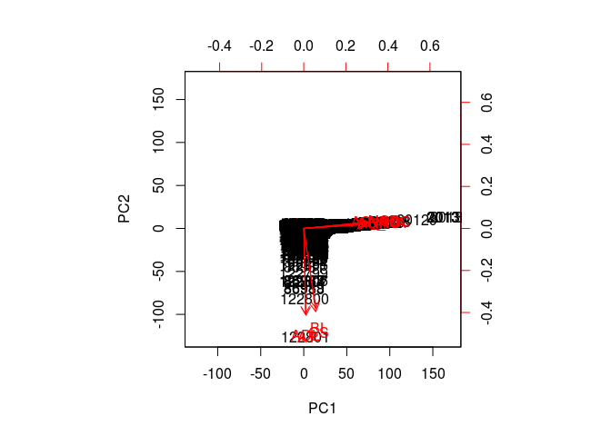
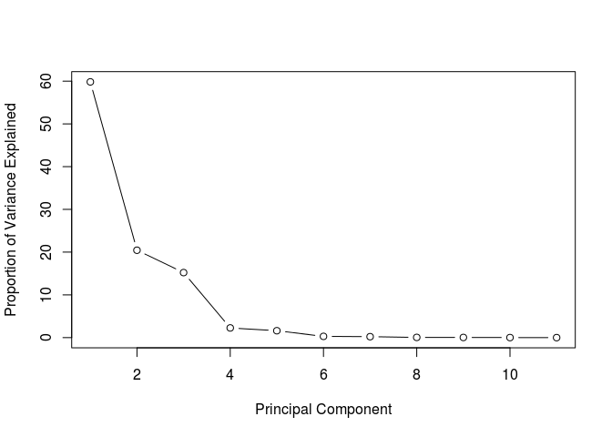
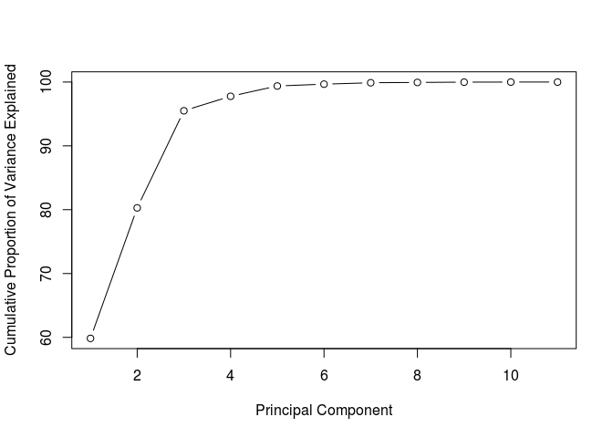
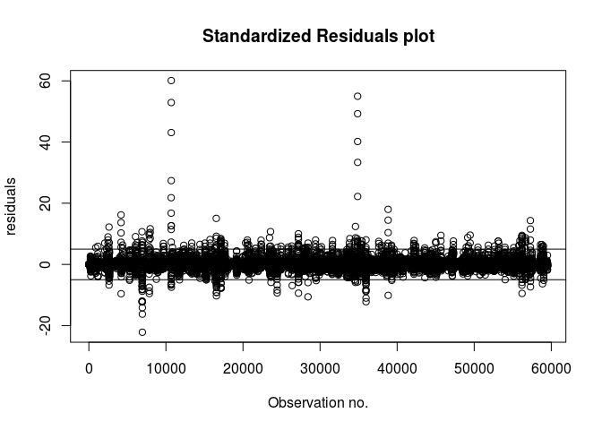
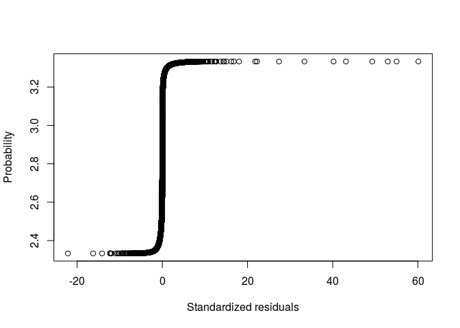
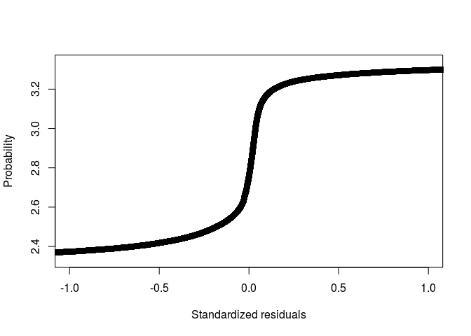

Online Buzz Prediction on Twitter
================

Let's take a look on the data.

    ##          NCD         AI      AS_NA        BL        NAC     AS_NAC
    ## 1 -0.2965941 -0.3183059 -0.3480090 -3.438032 -0.3055790 -0.3184644
    ## 2 -0.2968246 -0.3187991 -0.3488366 -3.438032 -0.3058017 -0.3187956
    ## 3 -0.2975161 -0.3202787 -0.3511123 -3.438032 -0.3064697 -0.3211135
    ## 4 -0.2965941 -0.3183059 -0.3506986 -2.461761 -0.3055790 -0.3207823
    ## 5 -0.2965941 -0.3183059 -0.3506986 -2.461761 -0.3055790 -0.3207823
    ##          CS         AT        NAO        ADL        NAD       MNAD
    ## 1 -3.491975 -0.7240877 -0.3289477 -0.7310262 -0.2970117 -0.2701534
    ## 2 -3.491975 -0.7240877 -0.3292478 -0.7310262 -0.2972420 -0.2708395
    ## 3 -3.491975 -0.7240877 -0.3301479 -0.7310262 -0.2979327 -0.2674093
    ## 4 -2.509767 -0.5579229 -0.3289477 -0.5762051 -0.2970117 -0.2701534
    ## 5 -2.509767 -0.5579229 -0.3289477 -0.5762051 -0.2970117 -0.2694674

Multicollinearity Diagnostics
-----------------------------

Correlation matrix
==================

    ##                NCD          AI      AS_NA        BL         NAC     AS_NAC
    ## NCD    1.000000000 0.876236015 0.89758018 0.1192051 0.998569740 0.92298806
    ## AI     0.876236015 1.000000000 0.89014213 0.1261385 0.876632001 0.79003421
    ## AS_NA  0.897580184 0.890142133 1.00000000 0.1390026 0.903897369 0.94278881
    ## BL     0.119205063 0.126138464 0.13900259 1.0000000 0.121554932 0.12629570
    ## NAC    0.998569740 0.876632001 0.90389737 0.1215549 1.000000000 0.92595796
    ## AS_NAC 0.922988061 0.790034209 0.94278881 0.1262957 0.925957963 1.00000000
    ## CS     0.115929347 0.122998215 0.13594199 0.9938652 0.118781652 0.12352554
    ## AT     0.011992586 0.019067626 0.02071662 0.1353892 0.015979654 0.01767762
    ## NAO    0.948988382 0.955667590 0.94845748 0.1306123 0.953580007 0.87933906
    ## ADL    0.003219328 0.009612417 0.01127623 0.1128369 0.008519014 0.01015258
    ## NAD    0.999997908 0.876288000 0.89789521 0.1193148 0.998660489 0.92316402
    ##               CS         AT         NAO         ADL         NAD
    ## NCD    0.1159293 0.01199259 0.948988382 0.003219328 0.999997908
    ## AI     0.1229982 0.01906763 0.955667590 0.009612417 0.876288000
    ## AS_NA  0.1359420 0.02071662 0.948457478 0.011276227 0.897895209
    ## BL     0.9938652 0.13538920 0.130612277 0.112836862 0.119314832
    ## NAC    0.1187817 0.01597965 0.953580007 0.008519014 0.998660489
    ## AS_NAC 0.1235255 0.01767762 0.879339061 0.010152581 0.923164018
    ## CS     1.0000000 0.17758982 0.127659030 0.161672297 0.116068425
    ## AT     0.1775898 1.00000000 0.018570140 0.976031343 0.012136599
    ## NAO    0.1276590 0.01857014 1.000000000 0.009599617 0.949212146
    ## ADL    0.1616723 0.97603134 0.009599617 1.000000000 0.003393779
    ## NAD    0.1160684 0.01213660 0.949212146 0.003393779 1.000000000

Most of the features are highly correlated. We can see that these features have a lot of common information.
-NCD AI AS_NA NAC AS_NAC NAO NAD 
-CS BL 
-AT ADL

So,we need to eliminate features which donot add much variance to the data. For that,let's look at the VIF table as well.

    ##    Variables          VIF
    ## 1        NCD 9.400885e+05
    ## 2         AI 2.560414e+01
    ## 3      AS_NA 1.774426e+02
    ## 4         BL 9.598035e+01
    ## 5        NAC 1.761030e+03
    ## 6     AS_NAC 1.594218e+02
    ## 7         CS 9.678539e+01
    ## 8         AT 1.737452e+01
    ## 9        NAO 2.909138e+02
    ## 10       ADL 1.821024e+01
    ## 11       NAD 1.001314e+06

An ideal VIF value is 1. So,any feature having vif value close to 1 is significant. A range of 1-5 for the VIF value is preferred. After 5, the feature is not considered significant. As we can see, our features lie nowhere near VIF value of 1.

So,this suggests that our features are highly correlated. And hence,we would have to run Principal Component Analysis on our data because neither correlation table nor VIF analysis is sufficient to differentiate between significant and insignificant features.

PCA analysis
============

For PCA,data needs to be: scaled all numeric and without missing values

``` r
features <- train[-c(12)]
prin_comp <- prcomp(features,scale. = T)
prin_comp$x[1:5,]
```

    ##         PC1      PC2      PC3          PC4          PC5           PC6
    ## 1 -1.300026 4.061074 2.708136 -0.015378687 -0.025980288 -0.0004283566
    ## 2 -1.300917 4.061007 2.708084 -0.015192968 -0.025574276 -0.0003792301
    ## 3 -1.303957 4.060775 2.707907 -0.015251053 -0.023932738 -0.0008631072
    ## 4 -1.157174 2.940816 1.882166 -0.006298887 -0.002266547  0.0010149047
    ## 5 -1.157174 2.940816 1.882166 -0.006298887 -0.002266547  0.0010149047
    ##           PC7           PC8         PC9        PC10         PC11
    ## 1 -0.04917162  0.0008117568 -0.01982261 0.002866512 3.591461e-05
    ## 2 -0.04916839  0.0005789146 -0.01983245 0.002841919 3.604363e-05
    ## 3 -0.04917318  0.0004874458 -0.01983983 0.002843028 3.627732e-05
    ## 4 -0.04608215 -0.0002825231 -0.01755560 0.001265933 1.239030e-05
    ## 5 -0.04608215 -0.0002825231 -0.01755560 0.001265933 1.239030e-05

``` r
dim(prin_comp$x)
```

    ## [1] 138861     11

Now,let’s plot the resultant principal components.

``` r
biplot(prin_comp,scale = 0)
```

 
We can see that PC1 and PC2 both come from some features which are marked red.
i.e. PC1 = a1x1 + a2x2 + a3x3 (say) and 
PC2 = b1x4 + b2x5 + b3x6 (say) 
Basically,PCA's are the resulatant of the correlated features.

Now,let's calculate the variance contribution of every principal component as we aim to find the components which explain the maximum variance. This is because, we want to retain as much information as possible using these components. So, higher is the explained variance, higher will be the information contained in those components.

``` r
std_dev <- prin_comp$sdev
pr_var <- std_dev^2
prop_varex <- (pr_var/sum(pr_var))*100
prop_varex
```

    ##  [1] 5.983751e+01 2.045092e+01 1.521456e+01 2.266109e+00 1.615689e+00
    ##  [6] 2.895581e-01 2.212197e-01 5.170297e-02 4.098495e-02 1.173542e-02
    ## [11] 5.106242e-06

As we can see,PCA1 contributes app. 59% of the variance and hence is the most important feature. 
For more meaningful inference,we make a scree plot. 
A scree plot is used to access components or factors which explains the most of variability in the data. It represents values in descending order.

``` r
plot(prop_varex, xlab = "Principal Component",
     ylab = "Proportion of Variance Explained",
     type = "b")
```



Here we can see that 6 components approximately 98% variance in the dataset. For the confirmation check,let's plot a cumulative variance plot.

``` r
plot(cumsum(prop_varex), xlab = "Principal Component",
     ylab = "Cumulative Proportion of Variance Explained",
     type = "b")
```



The graph clearly shows that we should select 6 features which explains almost 98% of the data. Hence,we will choose 6 variables from PC1 to PC6 for our model and continue further.

``` r
pca_data <- data.frame(prin_comp$x[,c(1:6)])
pca_data$MNAD <- train$MNAD
pca_data[1:5,]
```

    ##         PC1      PC2      PC3          PC4          PC5           PC6
    ## 1 -1.300026 4.061074 2.708136 -0.015378687 -0.025980288 -0.0004283566
    ## 2 -1.300917 4.061007 2.708084 -0.015192968 -0.025574276 -0.0003792301
    ## 3 -1.303957 4.060775 2.707907 -0.015251053 -0.023932738 -0.0008631072
    ## 4 -1.157174 2.940816 1.882166 -0.006298887 -0.002266547  0.0010149047
    ## 5 -1.157174 2.940816 1.882166 -0.006298887 -0.002266547  0.0010149047
    ##         MNAD
    ## 1 -0.2701534
    ## 2 -0.2708395
    ## 3 -0.2674093
    ## 4 -0.2701534
    ## 5 -0.2694674

Now,our training data looks like above. Let's do the correlation and VIF analysis on this.

``` r
cor(pca_data[-c(7)])
```

    ##               PC1           PC2           PC3           PC4           PC5
    ## PC1  1.000000e+00 -1.957974e-17 -4.799278e-17 -2.214892e-15  2.239723e-15
    ## PC2 -1.957974e-17  1.000000e+00  4.231617e-15 -5.402840e-17  3.604642e-16
    ## PC3 -4.799278e-17  4.231617e-15  1.000000e+00  3.281163e-16 -4.279334e-16
    ## PC4 -2.214892e-15 -5.402840e-17  3.281163e-16  1.000000e+00 -1.736649e-15
    ## PC5  2.239723e-15  3.604642e-16 -4.279334e-16 -1.736649e-15  1.000000e+00
    ## PC6  6.544796e-15  8.091517e-17 -6.454170e-16  8.597299e-16  1.035518e-15
    ##               PC6
    ## PC1  6.544796e-15
    ## PC2  8.091517e-17
    ## PC3 -6.454170e-16
    ## PC4  8.597299e-16
    ## PC5  1.035518e-15
    ## PC6  1.000000e+00

``` r
vif(pca_data[-c(7)])
```

    ##   Variables      VIF
    ## 1       PC1 1.278656
    ## 2       PC2 1.046930
    ## 3       PC3 1.046625
    ## 4       PC4 1.199276
    ## 5       PC5 1.163193
    ## 6       PC6 1.240137

As we can see, VIF values are close to 1 and correlation matrix also shows that features are independent. Now, our features are scaled and independent. Let's apply a regression model now.

General multiple regression model
---------------------------------

``` r
model=lm(MNAD~.,pca_data)
summary(model)
```

    ## 
    ## Call:
    ## lm(formula = MNAD ~ ., data = pca_data)
    ## 
    ## Residuals:
    ##     Min      1Q  Median      3Q     Max 
    ## -42.059  -0.011   0.003   0.012  70.624 
    ## 
    ## Coefficients:
    ##              Estimate Std. Error t value Pr(>|t|)    
    ## (Intercept) 0.0141252  0.0011358   12.44   <2e-16 ***
    ## PC1         0.3914790  0.0004427  884.31   <2e-16 ***
    ## PC2         0.0409386  0.0007572   54.06   <2e-16 ***
    ## PC3         0.0283823  0.0008779   32.33   <2e-16 ***
    ## PC4         0.3241814  0.0022748  142.51   <2e-16 ***
    ## PC5         0.2675612  0.0026941   99.31   <2e-16 ***
    ## PC6         0.1291322  0.0063639   20.29   <2e-16 ***
    ## ---
    ## Signif. codes:  0 '***' 0.001 '**' 0.01 '*' 0.05 '.' 0.1 ' ' 1
    ## 
    ## Residual standard error: 0.4232 on 138854 degrees of freedom
    ## Multiple R-squared:  0.8547, Adjusted R-squared:  0.8547 
    ## F-statistic: 1.361e+05 on 6 and 138854 DF,  p-value: < 2.2e-16

Here,we get an adjusted- R-square value of 0.8547 and all the features are significant as well. Now, our model seems good. But, we can still drop a variable to check if our model improves or not. For that,we can use methods of regression for propagating back-and-forth.

METHODS OF REGRESSION
=====================

1.Forward Selection Method 
2.Backward Elimination Method 
3.Stepwise Method

For our analysis,we have considered Backward elimination method.

``` r
bmodel <- step(model, direction = "backward", trace=TRUE )
```

    ## Start:  AIC=-238788.8
    ## MNAD ~ PC1 + PC2 + PC3 + PC4 + PC5 + PC6
    ## 
    ##        Df Sum of Sq    RSS     AIC
    ## <none>               24872 -238789
    ## - PC6   1        74  24946 -238380
    ## - PC3   1       187  25059 -237750
    ## - PC2   1       524  25396 -235898
    ## - PC5   1      1767  26639 -229262
    ## - PC4   1      3638  28510 -219836
    ## - PC1   1    140075 164947   23917

``` r
bmodel
```

    ## 
    ## Call:
    ## lm(formula = MNAD ~ PC1 + PC2 + PC3 + PC4 + PC5 + PC6, data = pca_data)
    ## 
    ## Coefficients:
    ## (Intercept)          PC1          PC2          PC3          PC4  
    ##     0.01413      0.39148      0.04094      0.02838      0.32418  
    ##         PC5          PC6  
    ##     0.26756      0.12913

As we can see,no features are rejected in the steps of backward-elimination method. Thus,we can conclude that our model will include all of the 6 variables. Now,let's take a look at the coefficients and confidence intervals of the features.

Coefficients
============

    ## (Intercept)         PC1         PC2         PC3         PC4         PC5 
    ##  0.01412517  0.39147901  0.04093860  0.02838228  0.32418139  0.26756121 
    ##         PC6 
    ##  0.12913215

Confidence Intervals
====================

    ##                  2.5 %     97.5 %
    ## (Intercept) 0.01189910 0.01635124
    ## PC1         0.39061133 0.39234668
    ## PC2         0.03945442 0.04242279
    ## PC3         0.02666154 0.03010301
    ## PC4         0.31972273 0.32864004
    ## PC5         0.26228083 0.27284159
    ## PC6         0.11665900 0.14160531

As we can see,all the coefficients lie in the confidence interval.

Now,let's get to the prediction part. For prediction,we should not use PCA on train and test separately as their variance is unequal which will result in different vector directions. Also,we should not combine the training and test set as we donot want our test set to be used in model building. What we can do is use predict function as shown below.

``` r
pc_data_test <- predict(prin_comp,test[-c(12)])
pc_data_test <- as.data.frame(pc_data_test)
pc_data_test <- pc_data_test[c(1:6)]
pc_data_test[1:5,]
```

    ##               PC1       PC2      PC3          PC4          PC5
    ## 138862 -0.9242058 -1.743193 4.503665  0.041880943  0.032483780
    ## 138863 -1.1546048  2.941014 1.882318 -0.006670066 -0.003252062
    ## 138864 -1.1546048  2.941014 1.882318 -0.006670066 -0.003252062
    ## 138865 -1.3027098  4.060876 2.707984 -0.015703194 -0.023869805
    ## 138866 -1.1587390  2.940685 1.882066 -0.005417740 -0.002812011
    ##                  PC6
    ## 138862  0.0115703087
    ## 138863  0.0012153638
    ## 138864  0.0012153638
    ## 138865 -0.0006873007
    ## 138866  0.0008238042

Now,let's predict on the above dataset.

``` r
pc_data_test$predicted_MNAD <- predict(model,pc_data_test)
pc_data_test$MNAD <- test$MNAD
pc_data_test$residuals <- pc_data_test$MNAD-pc_data_test$predicted_MNAD
pc_data_test[1:5,7:9]
```

    ##        predicted_MNAD       MNAD    residuals
    ## 138862     -0.2674591 -0.2708395 -0.003380369
    ## 138863     -0.2669284 -0.2708395 -0.003911097
    ## 138864     -0.2669284 -0.2701534 -0.003225066
    ## 138865     -0.2643190 -0.2701534 -0.005834383
    ## 138866     -0.2680943 -0.2701534 -0.002059159

We can see that residuals are very less which explains the accuracy of our model. But,we have to do residual analysis for more accurate results. Let's calculate the variance of residuals.

``` r
Se_sq <- sum((pc_data_test$residuals)^2)
n <- nrow(test)
p <- 7
var_res <- Se_sq/(n-p)
std_res <- sqrt(var_res)
std_res
```

    ## [1] 0.2261814

Now,let's do Standardized Residual Analysis.

``` r
pc_data_test$stand_residuals <- pc_data_test$residuals/std_res
mean(pc_data_test$stand_residuals)
```

    ## [1] 0.005919984

``` r
var(pc_data_test$stand_residuals)
```

    ## [1] 0.9998641

We can see that mean is close to 0 and variance is close to 1. Let's plot them.

``` r
plot(pc_data_test$stand_residuals,main = 'Standardized Residuals plot',
     xlab='Observation no.',ylab = 'residuals')
abline(h=5,untf = FALSE)
abline(h=-5,untf = FALSE)
```



Now,we can say that a large standaradized residual(&gt;5,say) potentially indicates an outlier.

``` r
qqnorm(pc_data_test$stand_residuals,
         ylab="Residuals",
         xlab="Normal Scores",main="Normal Q-Q plot") 
qqline(pc_data_test$stand_residuals)
```


Now,let's plot normal probability plot.

``` r
y <- (as.numeric(rownames(pc_data_test))-0.5)/nrow(pc_data_test)
x <- sort(pc_data_test$stand_residuals,decreasing = FALSE)
plot(x,y,
     xlab = 'Standardized residuals',
     ylab = 'Probability')
```

 This plot is not ideal as it contains a lot of outliers. Let's take a closer look.

``` r
plot(x,y,
     xlab = 'Standardized residuals',
     ylab = 'Probability',
     xlim = c(-1,1))
```

 This suggests a light-tailed distribution.
